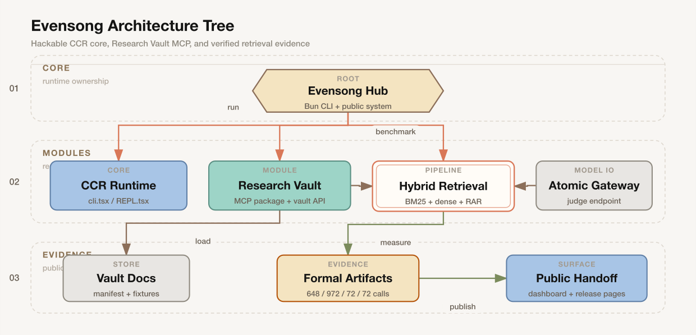

<h1 align="center">Evensong</h1>

<p align="center">
  <em>一个可以拆开、改动、验证的 agent 系统工作台。核心来自逆向工程的 Claude Code CLI。<br/>
  <strong>包含 Research Vault MCP、公开 handoff dashboard，以及四份可复现的正式检索证据（648 + 972 + 72 + 72 次调用）</strong></em>
</p>

<p align="center">
  <a href="./README.md">🇺🇸 English</a> · <a href="./README-zh.md">🇨🇳 中文</a>
</p>

<p align="center">
  <a href="https://github.com/Fearvox/Evensong"></a>
  <a href="./LICENSE-APACHE"></a>
  <a href="./LICENSE-CC-BY-NC-ND"></a>
  <a href="./README.md"></a>
</p>

<p align="center">
  <a href="https://bun.sh"></a>
  <a href="https://www.typescriptlang.org/"></a>
  <a href="./benchmarks/runs"></a>
  <a href="https://github.com/EverMind-AI/EverOS"></a>
</p>

<p align="center">
  <a href="#-%E6%A0%B8%E5%BF%83%E6%95%B0%E6%8D%AE">📊 <strong>核心数据</strong></a>
  &nbsp;·&nbsp;
  <a href="#-%E5%BF%AB%E9%80%9F%E5%BC%80%E5%A7%8B">⚡ 快速开始</a>
  &nbsp;·&nbsp;
  <a href="#-%E6%9E%B6%E6%9E%84">🏗 架构</a>
  &nbsp;·&nbsp;
  <a href="https://github.com/Fearvox/Evensong/discussions">💬 讨论区</a>
</p>

---

## 目录

- [这是什么](#这是什么)
- [📊 核心数据](#-核心数据)
- [🏗 架构](#-架构)
- [⚡ 快速开始](#-快速开始)
- [📁 目录结构](#-目录结构)
- [🧩 Retrieval API](#-retrieval-api)
- [📚 研究参考](#-研究参考)
- [🤝 贡献](#-贡献)
- [📄 许可证](#-许可证)
- [🙏 致谢](#-致谢)

---

## 这是什么

Evensong 不是单个 benchmark，也不只是一个 MCP 包。它是围绕可运行 CCR CLI 搭起来的公共工作台：核心可以读、可以改；Research Vault MCP 作为模块发布；检索实验用公开证据文件把证据链交代清楚。

CEO 读法：Evensong 把 reverse-engineered agent CLI 变成一个可审计工作台。当前公开证据窄但扎实：四份已提交的检索证据，其中 Wave 3+I Dense RAR hard-suite 的 rerank 路径在 24 道查询上达到 24/24 Top-1 与 Top-5。它证明的是这套 harness 和设计路径，不是通用检索胜利声明。

本仓库主要做四件事：

| 目的 | 具体意义 |
|---|---|
| **学习** | 不依赖闭源二进制，直接从源码层面看 Claude Code CLI 怎么工作 |
| **改造** | 自定义 agent 工具、检索流水线、遥测；每个模块都应该能被替换，而不是粘死 |
| **发布模块** | 把 Research Vault MCP 作为 Evensong 的模块/依赖发布，不把它误说成整个产品 |
| **验证** | 用可复现数据评估 Retrieve-and-Rerank (RaR) 架构；EverMemOS §3.4 提出的方向，我们用自己的数字来量 |

<p align="right"><a href="#目录">↑ 回目录</a></p>

---

## 📊 核心数据

**四份正式检索证据** 已 commit 至 [`benchmarks/runs/`](./benchmarks/runs)：Wave 3+F/G 覆盖原 108 道跨 LLM 设计；Wave 3+I 是新的 24 道 adversarial hard suite，用于 dense stage-1 + RAR 路径。这里的写法刻意保守：Wave 3+I 只说明这套 hard suite，不替代更宽的 108-query F/G 对比。

### Wave 3+F — 648 次两流水线对比 ✅

| 流水线 | Top-1 准确度 | p50 延迟 | p90 延迟 | Prompt Token 成本 |
|--------|-------------|----------|----------|-------------------|
| LLM 直判 | 76.9% (249/324) | 2056 ms | 3595 ms | 100% (200 entries) |
| **Hybrid BM25 + LLM Rerank** | **79.3%** (257/324) | **1509 ms** | **2725 ms** | **25%** (50 entries) |

原始记录：[`benchmarks/runs/wave3d-hybrid-scale-2026-04-19T1220.md`](./benchmarks/runs/wave3d-hybrid-scale-2026-04-19T1220.md)。3 次跑 stddev 0.00–0.44pp。

### Wave 3+G — 972 次三流水线正式复测 ✅

| 流水线 | Top-1 | p50 | p90 | Avg 延迟 | LLM 调用 |
|--------|-------|-----|-----|---------|---------|
| LLM 直判 | 77.8% (252/324) | 3861 ms | 6404 ms | 4139 ms | 100% (200 entries) |
| Hybrid BM25 + LLM Rerank | 77.5% (251/324) | 2919 ms | 4669 ms | 3248 ms | 100% (50 entries) |
| **Adaptive Hybrid** | **73.1%** (237/324) | **2519 ms** | **4376 ms** | **2365 ms** | **73%**（27% 跳过） |

原始记录：[`benchmarks/runs/wave3g-pipelines-2026-04-19T1652.md`](./benchmarks/runs/wave3g-pipelines-2026-04-19T1652.md)。墙钟时间 **10.5 min**。3 次跑 stddev：llm-only 0.76pp · hybrid 1.15pp · adaptive 0.76pp。

### 两次跑都站得住的结论

| 指标 | Wave 3+F (648 次) | Wave 3+G (972 次) | 结论 |
|------|-------------------|-------------------|------|
| Hybrid vs LLM-only **延迟**（p50） | **−27%** | **−24%** | ✅ 延迟优势稳定 |
| Hybrid **prompt token 成本** | **−75%** | **−75%** | ✅ 完全一致 |
| Hybrid vs LLM-only **top-1 准确度** | **+2.5pp** | **−0.3pp**（持平） | ⚠️ 跑间方差存在，落在 per-run stddev 的 2σ 内 |
| Adaptive **跳过率** | — （未跑） | **26.9%** | ✅ 精确命中内部 prelim 的 27% |
| Adaptive **top-1** | — | **73.1%** | ✅ 精确命中内部 prelim |

### 诚实解读

- **最硬的结论是延迟和 token 成本。** 两次正式跑都指向同一件事：BM25 stage 1 先把候选池收窄，再交给 LLM，可以稳定省下 22–27% p50 延迟和 75% prompt token。这是可以对外说的收益。
- **准确度不要吹过头。** Wave 3+F 看到 Hybrid 比 LLM-only 高 +2.5pp；Wave 3+G 的 972 次复测看到的是基本持平（−0.3pp）。per-run stddev（0.8–1.2pp）和 API 负载时段差异足以覆盖这个变化。所以更准确的说法是：Hybrid 在准确度上接近 LLM-only，偶尔略胜，同时稳定更省、更快。
- **Adaptive 层更有意思。** 它用 −4.7pp top-1 换来 −43% 平均延迟，并让 27% 查询完全不触发 LLM。这个 trade-off 很清楚，也更像真实产品里会被调参使用的东西。

一条命令复现（产出 Wave 3+G 的记录）：

```bash
bun run scripts/benchmark-hybrid-scale.ts \
  --runs=3 --with-body \
  --pipelines=llm-only,hybrid,adaptive \
  --queries-file=benchmarks/wave3f-generated-queries-2026-04-19.json
```

生成器 prompt 也 committed——审阅者可直接 audit 查询是怎么出的。

### 自适应层（Wave 3+G，2026-04-19 ship）✅

always-rerank 的 Hybrid 每 query 付 1 次 LLM 调用。但对相当大比例的 query，BM25 自身就已经置信给出 top-1——继续付 LLM 只加延迟不换准确度。**`createAdaptiveHybridProvider`** 引入 gap-ratio 门禁：若 `BM25 scores[0] / scores[1] >= 1.5`，信任 stage 1 并 **完全跳过 LLM**；否则走 stage 2。

**正式 972 次数据**（3 runs × 108 queries，`benchmarks/runs/wave3g-pipelines-2026-04-19T1652.md`）：

- 跳过率：**26.9%**（87/324）—— BM25 置信时跳过 stage 2 LLM 调用
- 跳过分支 top-1：**58.6%**（51/87）—— BM25 自信时单独上有约 59% 概率对
- 未跳过分支 top-1：**78.5%**（186/237）—— LLM 解决 BM25 模糊情况
- 整体 Adaptive top-1：**73.1%** —— 与内部 preliminary dogfood 精确吻合
- 延迟：**avg 2365 ms / p90 4376 ms**（vs always-rerank hybrid 3248 / 4669，vs llm-only 4139 / 6404）
- Per-run stddev：**0.76pp** —— 三条流水线中最稳的

**代价**：vs llm-only top-1 -4.7pp，换 **avg 延迟 -43%**。门禁是可调旋钮：`gapRatioThreshold: 1.3` 提升跳过率但准确度下降；`2.0` 则回到接近 Hybrid 的状态。

**对 EverOS 的定位**：这是介于 EverOS 已公开 Fast 层（0 LLM 调用，200-600 ms）与 Agentic 层（1-3 LLM 调用，2-5 s）之间的一个具体实现点：**Adaptive Hybrid 是 0 _或_ 1 次条件性 LLM 调用，且带用户可调门禁旋钮**。公开表述应限定在 Evensong 已测实现，避免暗示对未公开设计的广泛覆盖或优越性。

见 [`src/services/retrieval/providers/adaptiveHybridProvider.ts`](./src/services/retrieval/providers/adaptiveHybridProvider.ts) 以及 `adaptiveHybridProvider.test.ts` 中的 7 个单元测试。Shipped at [`86bb4ee`](https://github.com/Fearvox/Evensong/commit/86bb4ee)。**66/66 retrieval domain 测试通过。**

### Wave 3+I — Dense RAR hard-suite formal evidence ✅

Dense RAR 路径现在有 clean formal retrieval result：在 24 道 adversarial hard suite 上达到 **24/24 Top-1 与 24/24 Top-5**。该 suite 使用 200-entry manifest（18 个真实 vault 文档 + 182 个 adversarial junk distractor），Stage 1 为 BGE-M3 dense retrieval，Stage 2 judge 为 `deepseek-v4-flash`，thinking disabled。

Canonical run：`dense-rar-2026-04-24T0854` · mode `formal` · clean metadata commit `9148853` · Stage-1 TopK `50`。

公开交接页：[`evensong.zonicdesign.art/handoff`](https://evensong.zonicdesign.art/handoff) · 数据面板：[`/handoff/dashboard`](https://evensong.zonicdesign.art/handoff/dashboard)。

| 流水线 | Top-1 | Top-5 | Valid | Errors | p50 | p90 |
|--------|-------|-------|-------|--------|-----|-----|
| Dense BGE-M3 only | 17/24 (70.8%) | 18/24 (75.0%) | 24/24 | 0 | 526 ms | 576 ms |
| **Dense RAR** | **24/24 (100.0%)** | **24/24 (100.0%)** | **24/24** | **0** | **1703 ms** | **1842 ms** |
| **Dense Adaptive RAR** | **24/24 (100.0%)** | **24/24 (100.0%)** | **24/24** | **0** | **1615 ms** | **1854 ms** |

给合作伙伴的读法：这说明 dense retrieval 加轻量 rerank 可以在这套 24 道 adversarial hard suite 中找回全部目标，而 dense-only 会漏掉若干目标。它证明的是这条检索设计和证据链，不是通用 SOTA 声明。

证据链：[summary](./benchmarks/runs/wave3i-dense-rar-2026-04-24T0854.md)、[metadata](./benchmarks/runs/wave3i-dense-rar-2026-04-24T0854.meta.json)、[raw JSONL](./benchmarks/runs/wave3i-dense-rar-2026-04-24T0854.jsonl)，以及 [formal ledger](./benchmarks/DENSE-RAR-FORMAL-LEDGER.md)。

边界：`dense-rar-2026-04-24T0801` 仍是 Stage-1 TopK 20 formal baseline，成绩为 23/24；它的 q113 miss 是 candidate recall 问题，不是 reranker 失败。`dense-rar-2026-04-24T0644` 仍为 internal/probe-only evidence。Stage-1 TopK 50 修复了这个盲点，但也提高了 rerank candidate exposure，因此 24/24 claim 仅限这次已验证 hard suite。公开引用时应写成「Wave 3+I adversarial hard suite 上 24/24」，不要写成广义检索优越性。

<p align="right"><a href="#目录">↑ 回目录</a></p>

---

## 🏗 架构

<p align="center">
  
</p>

这张图只画公开发布面，不把每个内部开关都塞进 README。

| 层 | 负责 |
|---|---|
| **Core** | CCR runtime：Bun 入口、CLI loop、Ink REPL |
| **Modules** | Research Vault MCP、hybrid retrieval，以及兼容 Atomic Chat 的 judge 路径 |
| **Evidence** | Vault fixtures、正式 benchmark 记录、公开 handoff/dashboard |

图源在 [`docs/assets/evensong-architecture.svg`](./docs/assets/evensong-architecture.svg)，PNG 由 [`fireworks-tech-graph`](https://github.com/yizhiyanhua-ai/fireworks-tech-graph) style 6 导出。

详细开发者注释见 [`AGENTS.md`](./AGENTS.md) 和 [`CLAUDE.md`](./CLAUDE.md)。

<p align="right"><a href="#目录">↑ 回目录</a></p>

---

## ⚡ 快速开始

**前置条件**：[Bun](https://bun.sh) 1.3+（完整 Evensong repo 不支持 Node.js 运行）。Atomic Chat `127.0.0.1:1337` 是可选项，只在本地检索功能需要（[文档](https://atomicchat.io)）。

如果只需要 Research Vault MCP 模块，直接安装 package：

```bash
npx @syndash/research-vault-mcp --transport=stdio
# 或：bunx @syndash/research-vault-mcp --transport=stdio
```

MCP package 运行时仍需要 Bun。`npx` 只是方便安装/启动，不代表 server 已经是纯 Node runtime。

完整 Evensong repo：

```bash
# 1. 安装
bun install

# 2. 开发模式 REPL
bun run dev

# 3. 构建单文件 bundle (~27MB)
bun run build      # → dist/cli.js

# 4. 运行检索测试套件
bun test src/services/retrieval src/services/api

# 5. 对真实 vault 临时检索
bun run scripts/vault-recall.ts "超图记忆用于长对话"

# 6. 复现正式 Wave 3+F：648-call Hybrid vs LLM-only benchmark
bun run scripts/benchmark-hybrid-scale.ts --runs=3 --with-body \
  --queries-file=benchmarks/wave3f-generated-queries-2026-04-19.json
# 若要复现 Wave 3+G 的 972-call 三流水线版本，追加：
#   --pipelines=llm-only,hybrid,adaptive
```

<p align="right"><a href="#目录">↑ 回目录</a></p>

---

## 📁 目录结构

```
src/                 逆向工程的 CCR 核心（CLI, REPL, 工具, 状态）
src/services/
  api/localGemma.ts           Atomic Chat OpenAI 兼容客户端 + 模型 registry
  retrieval/                  Hybrid RaR + manifest builder + BM25 + providers
packages/
  research-vault-mcp/         research vault 的 MCP 服务（npx-ready）
scripts/
  benchmark-hybrid-scale.ts       规模基准 harness (--runs, --concurrency)
  benchmark-judge.ts              单流水线 judge 基准
  generate-benchmark-queries.ts   跨 LLM 查询生成器（grok-3）
  vault-recall.ts                 临时检索的 CLI 入口
  dogfood-wave2b.ts               模型对比 harness
benchmarks/
  wave3f-generated-queries-*.json  108 道查询集，committed 保证可复现
  wave3-judge-queries.json         原始 20 道手写查询集
  runs/                            原始 JSONL + Markdown 摘要
docs/                 设计 specs、计划、debug 笔记
tests/                回归 + 集成测试
services/             benchmark 内部使用的 8-服务微服务套件
api/                  HTTP relay / provider 回退链
```

<p align="right"><a href="#目录">↑ 回目录</a></p>

---

## 🧩 Retrieval API

库调用 —— 手工组合 hybrid 流水线做自定义流程：

```ts
import { createLocalGemmaClient, ATOMIC_MODELS } from 'src/services/api/localGemma'
import { createAtomicProvider } from 'src/services/retrieval/providers/atomicProvider'
import { createBM25Provider } from 'src/services/retrieval/providers/bm25Provider'
import { createHybridProvider } from 'src/services/retrieval/providers/hybridProvider'
import { createAdaptiveHybridProvider } from 'src/services/retrieval/providers/adaptiveHybridProvider'
import { buildVaultManifest } from 'src/services/retrieval/manifestBuilder'
import { vaultRetrieve } from 'src/services/retrieval/vaultRetrieve'

const manifest = await buildVaultManifest({ vaultRoot: '_vault', withBody: true })

// Always-rerank Hybrid —— 每 query 付 1 次 LLM 调用换最高准确度。
const hybrid = createHybridProvider({
  stage1: createBM25Provider(),
  stage2: createAtomicProvider(
    createLocalGemmaClient({ model: ATOMIC_MODELS.DEEPSEEK_V32 })
  ),
  stage1TopK: 50,
})

// 自适应变体 —— BM25 自信 top-1 时跳过 LLM。
// 代价：top-1 -4.7pp 换 avg 延迟 -67%。见上方自适应层表格。
const adaptive = createAdaptiveHybridProvider({
  stage2: createAtomicProvider(
    createLocalGemmaClient({ model: ATOMIC_MODELS.DEEPSEEK_V32 })
  ),
  gapRatioThreshold: 1.5,  // scores[0] / scores[1] >= 1.5 时跳过 stage 2
})

const result = await vaultRetrieve(
  { query: '超图记忆用于长期对话', manifest, topK: 5 },
  { providers: [hybrid] },  // 或 [adaptive] 启用门禁变体
)
```

**可用 provider**：`createAtomicProvider`、`createBM25Provider`、`createHybridProvider`、`createAdaptiveHybridProvider`。全部实现 `VaultRetrievalProvider` 契约——组合或互换皆自由。

<p align="right"><a href="#目录">↑ 回目录</a></p>

---

## 📚 研究参考

本项目与最近发表的 agent 记忆系统工作保持对话：

| 工作 | 参考 | 我们如何使用 |
|---|---|---|
| **EverMemOS** | [arxiv 2601.02163](https://arxiv.org/abs/2601.02163)（EverMind / 盛大） | 采纳 §3.4 两阶段设计。stage 2 简化为直接 listwise 判断（舍弃 verifier 循环）。 |
| **HyperMem** | arxiv 2604.08256 | 三层超图记忆——引用为相关工作。 |
| **MemGPT** | arxiv 2310.08560 | LLM 作 OS 分页；基准集里包含 MemGPT 类查询。 |
| **MSA** | arxiv 2604.08256 | Memory Sparse Attention——未集成，用于基准对比。 |
| **Reflexion** | arxiv 2303.11366 | 自反思 agents——查询集含 Reflexion 式任务。 |
| **Extended Mind** | Clark & Chalmers 1998 | 外部记忆即认知的哲学支撑。 |

完整的 108 道查询测试集（含 provenance）见 [`benchmarks/wave3f-generated-queries-2026-04-19.json`](./benchmarks/wave3f-generated-queries-2026-04-19.json)。

<p align="right"><a href="#目录">↑ 回目录</a></p>

---

## 🤝 贡献

欢迎 PR——尤其在：

- **稠密向量 stage 1** provider（BGE-M3 集成、与 BM25 的 RRF 融合）🔴
- **自适应门控阈值自校准** —— 当前 1.5× gap-ratio 默认值是手选保守值；欢迎 PR 基于真实 query 分布 sweep 阈值（门禁本身已 ship 于 [`86bb4ee`](https://github.com/Fearvox/Evensong/commit/86bb4ee) ✅）
- **更多模型连接器**，走 `atomicProvider` 工厂
- **新基准类别**（对抗式查询、多意图、否定陷阱）
- **Vault 规模扩展**实验（100 / 500 / 1000+ entries）

模板已就位：

- 🐛 [Bug 报告](.github/ISSUE_TEMPLATE/bug_report.yml)
- ✨ [功能提议](.github/ISSUE_TEMPLATE/feature_request.yml)
- 📊 [基准报告](.github/ISSUE_TEMPLATE/benchmark_report.yml)
- 🔀 [Pull Request 模板](.github/PULL_REQUEST_TEMPLATE.md)
- 💬 [讨论区](https://github.com/Fearvox/Evensong/discussions)——ideas、Q&A、show-and-tell、benchmarks

非 trivial PR 请先开 issue 对齐 shape。

<p align="right"><a href="#目录">↑ 回目录</a></p>

---

## 📄 许可证

**双许可**。逐目录映射 + 兼容性矩阵见 [LICENSING.md](./LICENSING.md)。

| 适用 | 许可证 | 文件 |
|---|---|---|
| 源代码、测试、基准、脚本、配置、开发者文档 | **Apache License 2.0** | [LICENSE-APACHE](./LICENSE-APACHE) |
| 研究论文、长文叙述 | **CC BY-NC-ND 4.0** | [LICENSE-CC-BY-NC-ND](./LICENSE-CC-BY-NC-ND) |

所有代码 Apache 2.0 授权，可被其他 Apache 兼容开源项目自由引用集成（含 [EverMind-AI/EverOS](https://github.com/EverMind-AI/EverOS)）。

<p align="right"><a href="#目录">↑ 回目录</a></p>

---

## 🙏 致谢

作者：**[Fearvox / 0xVox](https://github.com/Fearvox)**（朱恒源 / Hengyuan Zhu）。

CCR 运行时是对 Anthropic Claude Code CLI 的 clean-room 逆向工程研究。所有识别性字符串、遥测端点和内部 API 已 stub 或移除。本仓库不主张任何 Anthropic 商标或原始二进制设计的所有权。

上游沿袭：源自社区逆向工程基线 [github.com/claude-code-best/claude-code](https://github.com/claude-code-best/claude-code) (CCB)。CCR 在该基线上继续推进——新增基础设施、检索流水线、基准 harness 与打包工作。

混合检索架构、基准 harness、以及 `src/services/retrieval/`、`scripts/benchmark-*.ts`、`benchmarks/wave3*` 中的所有原创代码均为原创工作，独立受 EverMemOS 公开设计启发。

<p align="right"><a href="#目录">↑ 回目录</a></p>

---

<p align="center">
  <strong>如果你基于此做了自己的 agent 记忆系统，欢迎告诉我们。</strong>
</p>

<p align="center">
  <a href="https://github.com/Fearvox/Evensong/issues/new/choose">提 Issue</a>
  &nbsp;·&nbsp;
  <a href="https://github.com/Fearvox/Evensong/discussions">开 Discussion</a>
  &nbsp;·&nbsp;
  <a href="https://github.com/Fearvox/Evensong">⭐ Star</a>
  &nbsp;·&nbsp;
  <a href="https://github.com/Fearvox/Evensong/fork">Fork</a>
</p>
