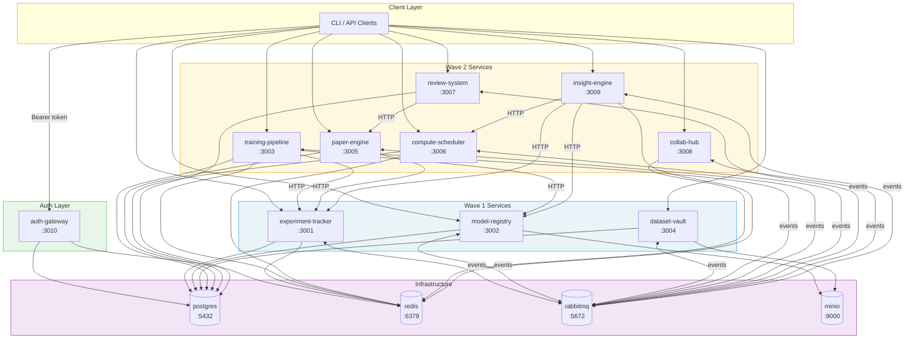
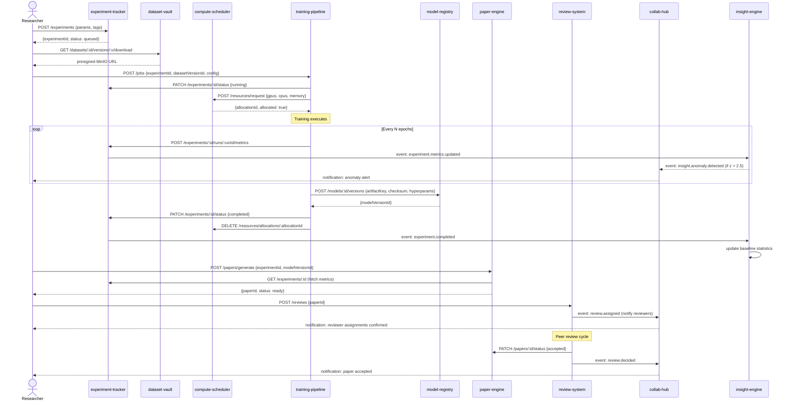
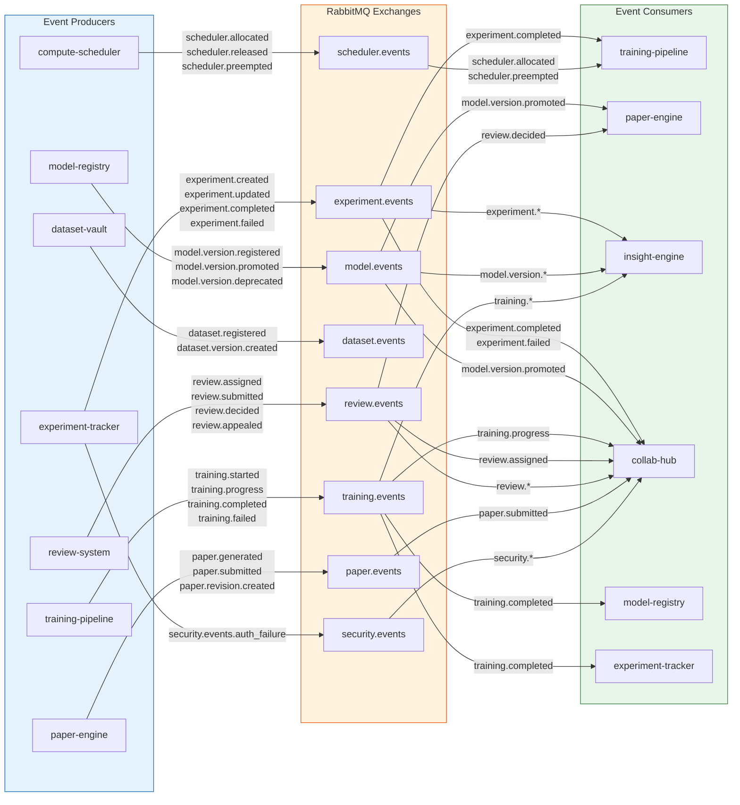

# Architecture Diagrams — Evensong III ML Research Platform

Three Mermaid diagrams covering system topology, experiment lifecycle data flow, and event bus interactions.

---

## Diagram 1: System Overview

All 10 application services and 4 infrastructure services with their connections and ports.

---

## Diagram 2: Experiment Lifecycle Data Flow

The full lifecycle of a single ML experiment from creation through paper submission.

---

## Diagram 3: Event Bus Interaction Map

All events published to and consumed from the RabbitMQ event bus, organized by exchange.

---

## Notes on the Diagrams

**Wave topology (Diagram 1):** The Wave 1 / Wave 2 boundary reflects the two-wave agent dispatch strategy in ADR-004. Wave 1 services (experiment-tracker, model-registry, dataset-vault, auth-gateway) have no upstream service HTTP dependencies and can start in parallel. Wave 2 services depend on Wave 1 health checks before startup.

**Event bus mock (Diagrams 2 & 3):** In unit and integration tests, the RabbitMQ exchanges are replaced by the in-process `EventEmitter` mock from `@evensong/event-bus/mock` (per ADR-002). The event naming and routing key conventions are identical between real and mock bus implementations, so diagrams represent both modes accurately.

**Auth flow:** auth-gateway is shown separately from Wave 1 because its role is cross-cutting — it validates tokens for all other services but is not an upstream dependency for service startup. Services validate tokens locally via the shared `@evensong/auth` package; they do not make synchronous calls to auth-gateway per request.
